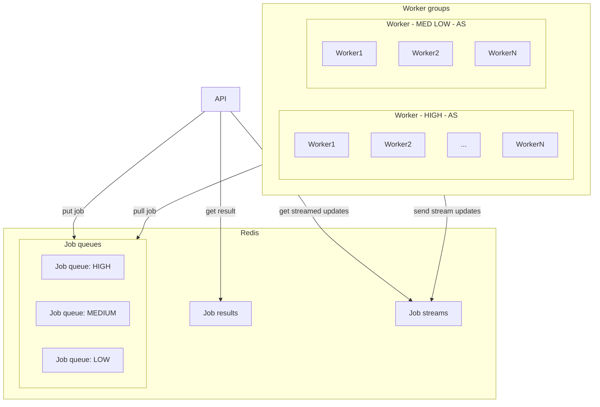

```mermaid
graph
  api[API]
  subgraph redis[Redis]
    job_queues[Job queues]
    subgraph job_queues[Job queues]
      job_queue_high[Job queue: HIGH]
      job_queue_medium[Job queue: MEDIUM]
      job_queue_low[Job queue: LOW]
    end
    job_results[Job results]
    job_streams[Job streams]
  end

  subgraph worker[Worker groups]
    subgraph worker_group_1[Worker - HIGH - AS]
      worker_1_1[Worker1]
      worker_1_2[Worker2]
      ...
      worker_1_N[WorkerN]
    end

    subgraph worker_group_2[Worker - MED LOW - AS]
      worker_2_1[Worker1]
      worker_2_2[Worker2]
      ...
      worker_2_N[WorkerN]
    end
  end


  api -- put job --> job_queues
  api -- get result --> job_results
  api -- get streamed updates --> job_streams
  worker -- pull job --> job_queues
  worker -- send stream updates --> job_streams
```
